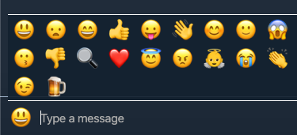
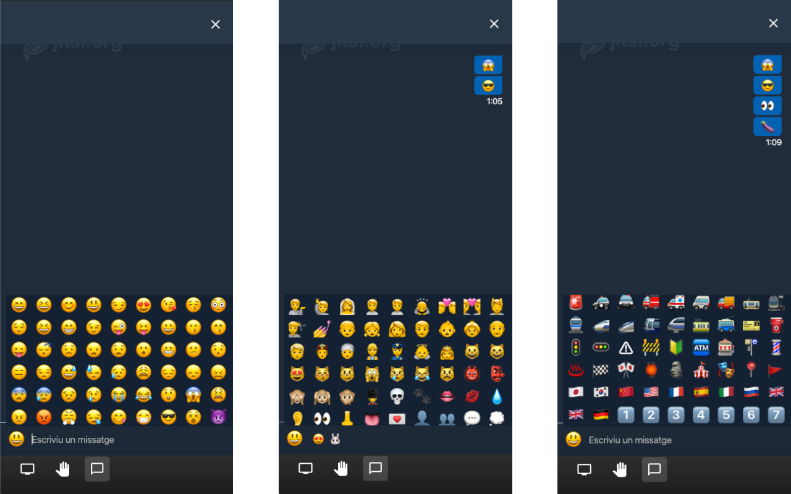

# Jitsi Emojis 😜

This project is a browser extension for Chrome and Firefox that allows [Jitsi Meet](https://github.com/jitsi/jitsi-meet) users to use more emojis than the given in the existing chat.

### Default avilable Emojis:

### New Emojis using the extension:

Jitsi Emojis browser extension has been published in the [Google Web Store](https://chrome.google.com/webstore/detail/efpjapcfbmghlhgbbbnacehjejacemdn) and [Firefox Browser Add-ons](https://addons.mozilla.org/ca/firefox/addon/jitsi-emojis/).

## Author

Guillem Palomar

## Contributing

If you think that an emoji is missing or anything can be improved, please open an issue or create a pull request. Any help is welcome.

## License

Jitsi Emojis is released under the MIT License. See the LICENSE file for further details.
